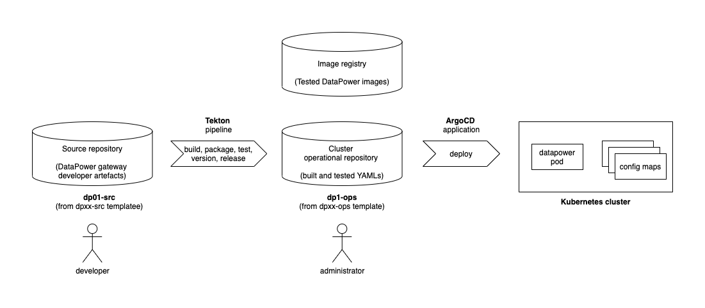
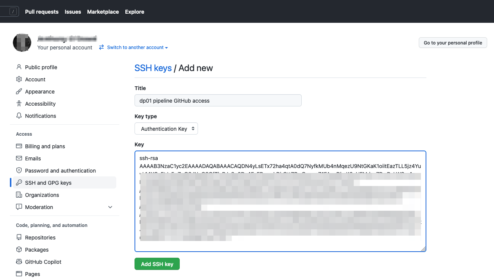

# dp-auto-ops
Operational repository to deploy to the cluster

## Overview

The following diagram shows a GitOps CICD pipeline for DataPower:



Notice how: 

- The git repository `dp01-src` holds the source configuration for the DataPower `dp01`
- This repository also holds the source for a multi-protocol gateway
- A Tekton pipeline usese the source repository to build, package, test, version and deliver changes to the `dp01` component.
- If the pipeline is successful, then the YAMLs that define `dp01` are stored in the operational repository `dp01-ops`. The container image for `dp01` is stored in an image registry.
- Shortly after the changes are committed to the git repository, an ArgoCD application detects the updated YAMLs. It applies them to the cluster to update the running `dp01`

This tutorial will walk you through the process of setting up this configuration"
- Step 1: Follow the instructions in this README to set up your cluster, `dp01-ops` repository and ArgoCD. 
- Step 2: Complete the tutorial by following [these instructions](https://github.com/dp-auto/dpxx-src#readme) to populate the `dp01-ops` repository with dp01 artefacts.  

## Install Kubernetes

Cover Minikube OCP options -->links

---

## install Tekton 
  - operator hub or CLI (minikube)?  
  - (manual Tekton install: kubectl apply -f https://storage.googleapis.com/tekton-releases/pipeline/previous/v0.16.3/release.yaml)
  - (manual approval)

---

## Fork repository
[Fork this repository](https://github.com/dp-auto/dpxx-ops/generate) from a `Template`. 
  - Ensure you include all branches by tickinging `Include all branches`. 
  - Fork the respository to **your Git user** e.g. `<mygituser>/dp01-ops`

---

## Clone repository to your local machine

Open new Terminal

Set userid, to your userid, e.g. `odowdaibm`

```bash
export GITUSER=odowdaibm
```

```bash
mkdir -p $HOME/git/datapower
cd $HOME/git/datapower
git clone git@github.com:$GITUSER/dp01-ops.git
```

---

## Create catalog sources

```bash
oc apply -f setup/catalog-sources.yaml
```

---

## Create Datapower `dev` namespace 

```bash
oc apply -f setup/namespaces.yaml
```

---

## Install ArgoCD 

```bash
oc apply -f setup/argocd-operator-sub.yaml
```
HERE!
oc get installplan -n dp01-mgmt -o yaml | grep "name: in" | awk '{print$2}' | xarg oc patch installplan install-xxxxx \
    --namespace openshift-logging \
    --type merge \
    --patch '{"spec":{"approved":true}}'

---


## Install Tekton pipelines

```bash
oc apply -f setup/tekton-operator-sub.yaml
```

---

## Install DataPower operator

```bash
oc apply -f setup/dp-operator-sub.yaml
```

---

## Manually approve in OCP UI

Fix this with oc patch

```bash
oc get installplan -n dp01-mgmt -o yaml | grep "name: in" | awk '{print$2}' | xarg oc patch installplan install-xxxxx \
    --namespace openshift-logging \
    --type merge \
    --patch '{"spec":{"approved":true}}'

oc patch installplan install-xxxxx \
    --namespace openshift-logging \
    --type merge \
    --patch '{"spec":{"approved":true}}'
```

---

## Generate ssh keys for GitHub access

```bash
ssh-keygen -t rsa -b 4096 -C "your_email@example.com" -f ./.ssh/id_rsa -q -N ""
```

```bash
ssh-keyscan -t rsa github.com | tee ./.ssh/github-key-temp | ssh-keygen -lf - && cat ./.ssh/github-key-temp >> ./.ssh/known_hosts
```

```bash
oc create secret generic dp01-ssh-credentials -n dp01-dev --from-file=id_rsa=./.ssh/id_rsa --from-file=known_hosts=./.ssh/known_hosts --from-file=./.ssh/config --dry-run=client -o=yaml
```

```bash
oc create secret generic dp01-ssh-credentials -n dp01-dev --from-file=id_rsa=./.ssh/id_rsa --from-file=known_hosts=./.ssh/known_hosts --from-file=./.ssh/config --dry-run=client -o yaml > dp-git-credentials.yaml
```

```bash
oc apply -f dp-git-credentials.yaml
```

---

## Copy ssh credential into Github

Need to add ssh public key to GitHub to authorise access:

```bash
https://github.com/settings/keys
```


Copy public key to clipboard

```bash
pbcopy < ./.ssh/id_rsa.pub
```

Click on `New SSH Key`

* Add name `dp01 SSH key`
* Paste key into box



* Hit `Add SSH key` button

---

## Patch `pipeline` serviceaccount

```bash
oc patch serviceaccount pipeline \
    --namespace dp01-dev \
    --type merge \
    --patch '{"secrets":[{"name":"dp01-ssh-credentials"}]}'
```
